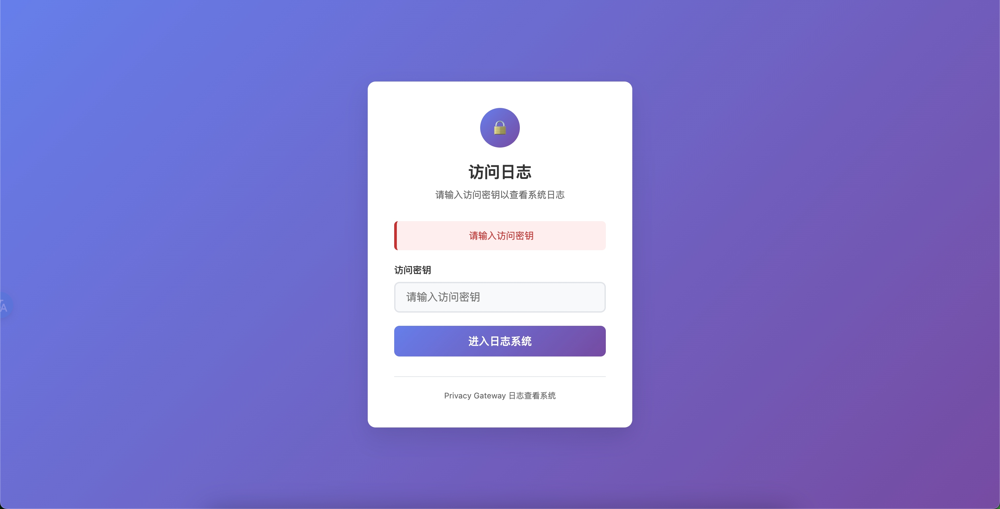
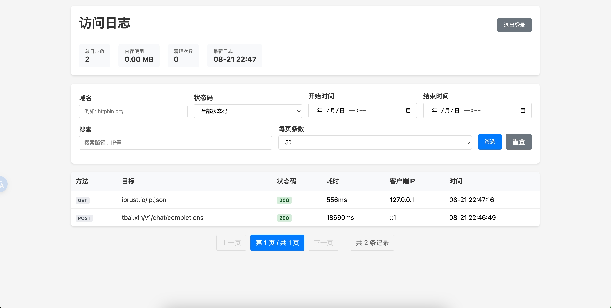
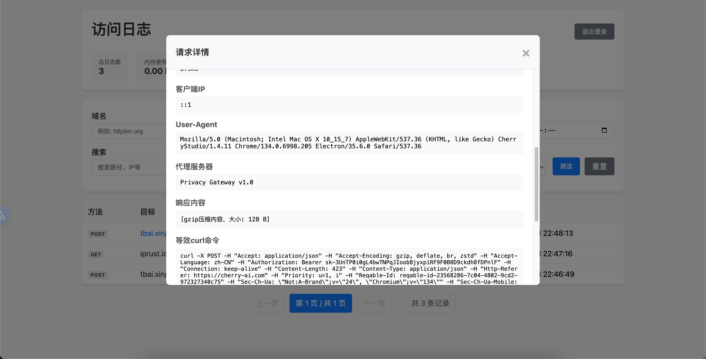

# 隐私网关 (Privacy Gateway)

[](https://github.com/Jesn/PrivacyGateway/actions/workflows/docker-build.yml)
[](https://hub.docker.com/r/richpeople/privacy-gateway)
[](https://hub.docker.com/r/richpeople/privacy-gateway)
[](LICENSE)

一个轻量级的反向代理服务，通过过滤敏感头信息来增强隐私保护，支持HTTP/HTTPS、WebSocket代理，并提供完整的访问日志管理功能。

## ✨ 主要功能

- 🔒 **隐私保护** - 自动过滤敏感请求头信息
- 🌐 **多协议支持** - HTTP/HTTPS/WebSocket代理
- 🚀 **代理支持** - 支持设置上游代理（HTTP/HTTPS/SOCKS5）
- 📊 **访问日志** - 实时日志查看和管理
- 🔍 **智能搜索** - 多维度日志筛选和搜索
- 📋 **curl生成** - 自动生成等效curl命令
- 🎯 **请求类型识别** - 自动识别HTTP、HTTPS、WebSocket、SSE
- 🔧 **灵活配置** - 支持环境变量和配置文件

## 🚀 快速开始

### Docker 部署（推荐）

```bash
# 直接运行
docker run -d -p 10805:10805 richpeople/privacy-gateway:latest

# 或使用 docker-compose
curl -O https://raw.githubusercontent.com/Jesn/PrivacyGateway/main/docker-compose.yml
docker-compose up -d
```

### 下载二进制文件

从 [GitHub Releases](https://github.com/Jesn/PrivacyGateway/releases) 下载适合你系统的版本：

```bash
# 下载并运行（以Linux为例）
wget https://github.com/Jesn/PrivacyGateway/releases/latest/download/privacy-gateway-linux-amd64
chmod +x privacy-gateway-linux-amd64
./privacy-gateway-linux-amd64
```

### 本地构建

```bash
go build -o privacy-gateway .
./privacy-gateway
```

## 📖 使用方法

### HTTP/HTTPS 代理

```bash
# 基本格式
http://localhost:10805/proxy?target=<目标URL>

# GET 请求示例
curl "http://localhost:10805/proxy?target=https://httpbin.org/get"

# POST 请求示例
curl -X POST -H "Content-Type: application/json" \
  -d '{"key":"value"}' \
  "http://localhost:10805/proxy?target=https://httpbin.org/post"
```

### WebSocket 代理

```bash
# WebSocket 连接格式
ws://localhost:10805/ws?target=<目标WebSocket地址>

# 使用 wscat 测试
wscat -c "ws://localhost:10805/ws?target=wss://echo.websocket.events"
```

### 管理界面

```bash
# 访问日志管理页面（需要设置 ADMIN_SECRET）
http://localhost:10805/logs
```

## ⚙️ 配置

项目支持通过环境变量进行配置。详细的配置参数说明请查看 `.env.example` 文件。

主要配置项：
- `GATEWAY_PORT` - 服务端口（默认10805）
- `ADMIN_SECRET` - 管理界面密钥
- `LOG_RECORD_200` - 是否记录成功请求详情（默认false）
- `SENSITIVE_HEADERS` - 要过滤的敏感头信息

```bash
# 复制配置模板并自定义
cp .env.example .env
nano .env
```

## 📸 功能展示

### 管理界面登录

当设置了 `ADMIN_SECRET` 后，首次访问管理页面需要进行身份验证：



### 访问日志列表

登录后可以查看实时的访问日志，支持多维度筛选和搜索：



*日志列表展示了请求方法、类型、目标地址、状态码、耗时等关键信息，不同的请求类型用不同颜色的标签区分。*

### 请求详情查看

点击日志条目可以查看完整的请求和响应详情，包括自动生成的curl命令：



*详情页面提供了完整的请求信息、响应内容，以及可一键复制的等效curl命令，方便调试和重现请求。*

## 🚀 Docker Hub

项目镜像已发布到Docker Hub，支持多平台：

- **仓库地址**: [richpeople/privacy-gateway](https://hub.docker.com/r/richpeople/privacy-gateway)
- **支持平台**: `linux/amd64`, `linux/arm64`
- **标签策略**:
  - `latest` - 最新稳定版本
  - `v1.0.0` - 具体版本号
  - `main` - 主分支最新代码

```bash
# 拉取最新版本
docker pull richpeople/privacy-gateway:latest

# 拉取特定版本
docker pull richpeople/privacy-gateway:v1.0.0
```

## 🔄 CI/CD

项目使用GitHub Actions自动构建和发布：

- ✅ **自动构建** - 推送到main分支时自动构建Docker镜像
- ✅ **多平台支持** - 同时构建AMD64和ARM64架构
- ✅ **版本发布** - 创建tag时自动发布新版本
- ✅ **Docker Hub推送** - 自动推送到Docker Hub
- ✅ **GitHub Releases** - 自动创建Release并上传二进制文件
- ✅ **多平台二进制** - 自动构建6个平台的可执行文件

### 发布新版本

```bash
# 使用发布脚本（推荐）
./scripts/release.sh 1.0.0

# 或手动创建标签
git tag v1.0.0
git push origin v1.0.0
```

发布后GitHub Actions将自动：
1. 🔨 构建6个平台的二进制文件
2. 🐳 构建并推送多平台Docker镜像
3. 📦 创建GitHub Release
4. ⬆️ 上传所有文件到Release
5. 🔐 生成SHA256校验文件

## 📝 注意事项

- 目标URL包含特殊字符时需要进行URL编码
- 生产环境建议设置 `ADMIN_SECRET` 和代理白名单
- 支持HTTP/HTTPS/WebSocket/SSE等多种协议
- 详细配置说明请参考 `.env.example` 文件
